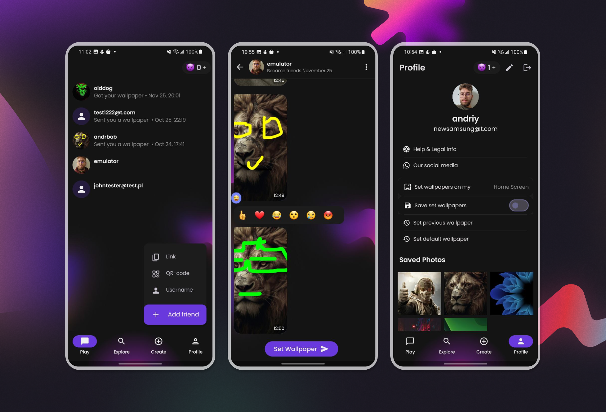

<h3 align="center">
  PlayWall
</h3>

A vibrant social media app for sharing wallpapers with friends and the world.

  

  
  
  
  
  
  
  
  
  

  <a href="#-about-the-project">About the project</a>&nbsp;&nbsp;&nbsp;|&nbsp;&nbsp;&nbsp;
  <a href="#-technologies">Technologies</a>&nbsp;&nbsp;&nbsp;|&nbsp;&nbsp;&nbsp;
  <a href="#-license">License</a>

## 👨🏻‍💻 About the project

**PlayWall** is a unique wallpaper-sharing social media platform. Users can exchange custom wallpapers, react to designs, comment on creations, and explore trending wallpapers shared by the community. With **PlayWall**, the mundane act of choosing wallpapers transforms into a creative and interactive experience.

Key features include:
- **Personalized Sharing:** Send custom wallpapers directly to friends or share them with the community.
- **Reactions and Comments:** Engage with wallpapers by reacting and commenting.
- **Explore Trending Designs:** Discover fresh and inspiring wallpapers from around the world.
- **Wallpaper History:** Track past exchanges and keep your memories in the app.

Whether you're looking to personalize your device or inspire others with your creativity, PlayWall is the place to be.

---

## 🚀 Technologies

Technologies and tools used to develop PlayWall:

- **Frontend:**
  - [Jetpack Compose](https://developer.android.com/jetpack/compose)
  - [Kotlin](https://kotlinlang.org/)

- **Backend:**
  - [Node.js](https://nodejs.org/)
  - [Express.js](https://expressjs.com/)
  - [MySQL](https://www.mysql.com/)
  - [Amazon S3](https://aws.amazon.com/s3/) for wallpaper storage

- **Additional Libraries & Tools:**
  - [Retrofit](https://square.github.io/retrofit/) for networking
  - [Firebase Authentication](https://firebase.google.com/products/auth)
  - [Glide](https://github.com/bumptech/glide) for image loading
  - [Room Database](https://developer.android.com/jetpack/androidx/releases/room) for local caching
  - [Material Design 3](https://m3.material.io/) for UI components
  - [Coroutines](https://kotlinlang.org/docs/coroutines-overview.html) for asynchronous operations

---

## 📝 License

This project is proprietary, and its source code is strictly forbidden from being used, distributed, or modified in any form without explicit written permission from the owner.

Made with ❤️ by Andriy Bobchuk
